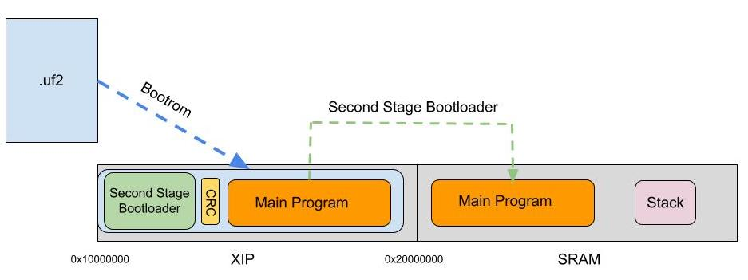
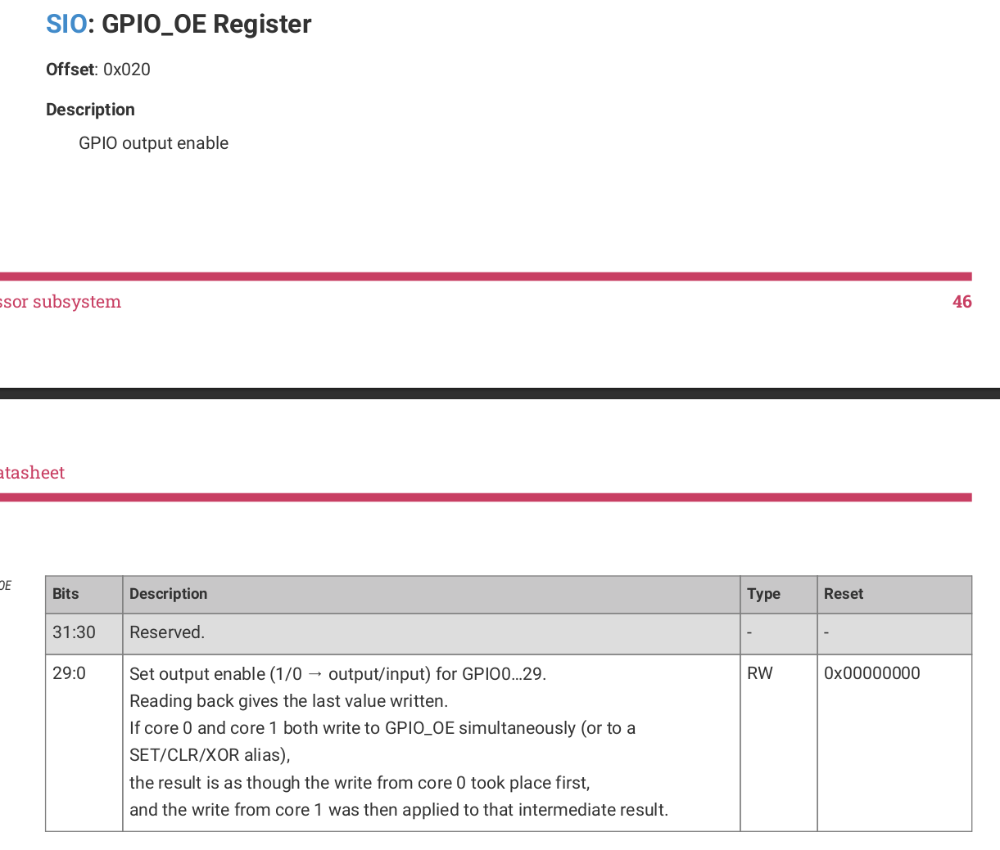

## Pico Lab
When starting this lab keep in mind that there are lots of ways to make it better. Especially when it comes to how I utilize the meson build system. One example is how I use object files instead of share library within all my sub programs. I made a couple attempts to make it work but Meson makes too many assumptions. This is one of the tradeoffs you make with a build system thats supposed to be easier and faster. So summary if you feel like something could be done better feel free to completely restructure my folder setup and code. Let me know if you have any good suggestions for increasing readability.

## Part 0 (Check that Pico Works)
The pico's bootrom as outlined in Section 2.8 has a .uf2 file bootloader. If you copy a valid UF2 as defined in section 2.8.4.2 the pico will automatically load the program into flash. More of these details will be covered in following parts but for now we'll make sure that the pico works. Copy the .uf2 file inside of the bin folder to your pico and make sure that the provided LED is blinking.  

## Part 1 (Setting up shared library)
Paste your arm-cross-comp.txt file into the library folder. Checkout some of the libraries to get a better idea of all the parts that are available. You should be able to use the commands covered in the prelab to build the library. After running `meson install` you should notice that you have an objects directory with some .o files. There are various TODO's throughout the directory that will hopefully explain all the pieces that came together to make this work. I highly recommend you download [https://marketplace.visualstudio.com/items?itemName=wayou.vscode-todo-highlight](this) vscode extension to make sure you dont miss one.

## Part 2 (Second Stage Bootloader)
I will quickly outline the overall steps our bootloader is going through to run our .uf2 file. Hopefully the diagram below is helpful in understanding how everything works. 

After copying over out .uf2 file over the Bootrom will have placed our file contents in flash. Our Second Stage Bootloader is capped at a max size of 252 bytes. Our Second Stage Bootloader will do the following

1.Setup permissions for reading from flash as described on page 152. The code for this is described in start.S
We will copy over the contents of our main program to SRAM
2.We will have our stack point at position far away from our program
3.Finally jump to our main function which we have renamed to mymain so that our compiler does not complain about redefining main.
Note: All assembly is written in ARM Thumb v2. The Pico's CPU only runs thumb instructions which is why the Makefile contains the XCPU flag to make sure you don't write regular ARM instructions.

Here are a list of things you have to get done for this part

1. Finish copy loop in Start.S
2. Finish gpio.c
3. update meson.build file
4. build everything

Note: GPIO_OE (output enable) is a stupid name. It's not only for output.

## Part 3 (0-Blinker)
Now lets test that you're code from part 2 actually works. Enter the programs directory and follow the directions in 0-blinker.

## Part 4 (Non Jank way of doing time)
The clock.c file inside of the library directory is far from the best solution. It's the duct taped solution that works because all of my errors are consistent. In the 1-timer program we will attempt to fix this. Note: that the resulting code has some bugs but hopefully I'll find the one random register I'm forgetting to write to. Enter the program directory and follow the direcitons in 1-timer

## Part 5 (Hello World)
